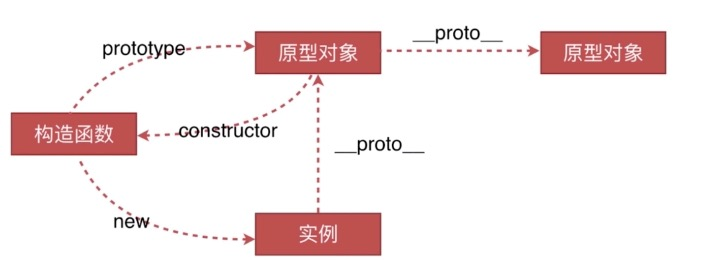
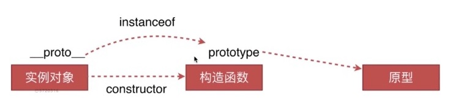

## 原型链

- 创建对象的几种方法
    * 字面量
    * 构造函数
    * Object.create
    * ./index.html
- 原型，构造函数，实例，原型链
    
    * 构造函数通过 new 实例化实例
    * 构造函数的 prototype 属性指向原型对象
    * 原型对象的 constructor 指向构造函数
    * 实例的 __proto__ 指向原型对象
    * 原型链查找：实例（通过__proto__）-> 原型对象（通过__proto__）-> 上级原型对象（通过__proto__）... -> Object.prototype（顶级）
    * 只有构造函数才有 prototype
    * 只有实例对象才有 __proto__
- instanceof的原理
    
    * instanceof判断某实例是否属于某构造函数，可沿原型链查找
    * 可用于精准判断数据类型，而typeof判断{}、[]、null时均返回object
    * instanceof判断原理是判断实例的__proto__与构造函数的prototype是否引用同一地址。是则返回true，否则沿原型链查找判断。因此不能据此准确判断该实例为原型链上谁的实例
    * 使用实例.__proto__.constructor === 构造函数判断是否为其实例
- new 运算符
    * new 构造函数
    * 创建一个新对象，它继承自构造函数Foo.prototype
    * 执行构造函数Foo，传入传参，同时新对象关联为this的上下文（即this指向新对象）
    * 若函数没有返回对象，则返回this