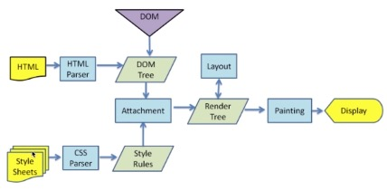

### 渲染机制（浏览器如何渲染页面）
- 什么是DOCTYPE及作用
    * DTD(document type definition, 文档类型定义)是一系列语法规则，用来定义XML或(X)HTML文件类型。浏览器会使用它来判断文档类型，决定使用何种协议来解析，以及切换浏览器的模式
    * DOCTYPE是用来声明文档类型和DTD规范的，一个主要用途是文件的合法性验证。如果文件代码不合法，那么浏览器解析时便会出一些差错
    * HTML5的类型 `<!DOCTYPE html>`
    * HTML4中有两种类型：严格模式和传统模式，两者区别，前者不包括弃用元素，后者包括
- 浏览器渲染过程
    
    * html->DOMTree style->StyleRules
    * DOMTree+StyleRules->RenderTree
    * RenderTree+Layout(在像素级计算每个dom的位置和宽高)->Painting->Display
- 重排Reflow
    * 定义：DOM结构中，每个元素都有自己的盒模型，需要浏览器根据样式来计算它们该出现的位置，这个过程叫重排
    * 触发重排
        + 增，删，改dom节点时
        + 移动dom位置时
        + 修改css样式时（如：改变宽高、display）
        + Resize窗口(移动端没有这个问题)，或滚动时
        + 修改页面的默认字体时
        + 避免重排:通过display:none属性隐藏元素（只有一次重排重绘），添加足够多的变更后，通过display属性显示（另一次重排重绘）。通过这种方式即使大量变更也只触发两次重排)
- 重绘Repaint
    * 定义:页面要呈现的内容通通呈现出来
    * 触发重绘
        + DOM改动
        + CSS改动
    * 如何尽量减少重绘
        + 所有的改动合并成一次性的